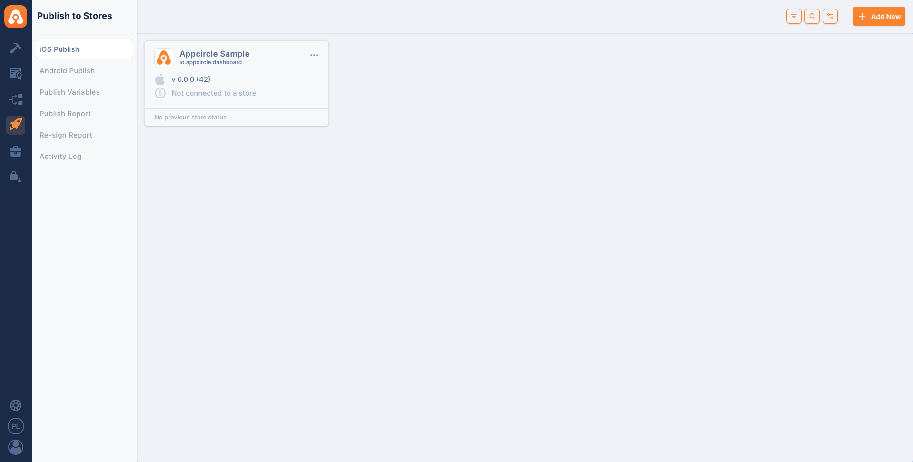

## Appcircle Publish

Upload an application binary to an Appcircle **Publish** profile and/or trigger
its publish flow (app store publishing) directly from your GitHub workflow.

Appcircle's **Publish to Stores** module gives you:

- **Centralized Store Publishing:** Manage App Store, Google Play, Huawei AppGallery, and Microsoft Intune releases from a single hub instead of navigating each platform separately.
- **Custom Publish Flows:** Automate your release cycle with repeatable publish flows and ready-to-use integrations tailored to your organization's needs.
- **Approval Gates:** Add manual approval steps to your publish flow to keep every release under control before it goes live.
- **Auto Re-sign:** Automatically apply updated signing credentials and versioning to uploaded binaries, keeping releases properly signed without a new build.
- **Audit and Reporting:** Track every publishing step with audit trails and publish reports for full transparency and compliance.

Learn more about
[Appcircle Publish](https://appcircle.io/publish-to-stores?utm_source=github&utm_medium=plugin&utm_campaign=publish).

### System Requirements

**Compatible Agents:**

- macos-14 (arm64)
- Ubuntu-22.04

Note: Both Appcircle Cloud and self-hosted Appcircle installations are supported.
See [Self-Hosted Appcircle](#self-hosted-appcircle) below to configure custom
endpoints.



### Generating/Managing the Personal API Tokens

To generate a Personal API Token:

1. Go to the My Organization screen (second option at the bottom left).
2. Find the Personal API Token section in the top right corner.
3. Press the "Generate Token" button to generate your first token.


## What the action does

The action has two independent switches (`upload` and `publish`), both default
to `false`. **You must enable at least one.** Create the Publish profile in
Appcircle first; the action targets it by name (profile names are unique per
platform).

| `upload` | `publish` | Behavior |
|:--------:|:---------:|----------|
| `true`  | `false` | Upload `appPath` as a new app version on the profile. |
| `false` | `true`  | Trigger the publish flow for the profile's **current release candidate**. |
| `true`  | `true`  | Upload `appPath`, **mark the new version as release candidate**, then trigger the publish flow for it. |
| `false` | `false` | Error: nothing to do. |

**Rules:**

- **In-progress guard:** if a publish is already running for the target profile,
  the action does **not** start a new one and fails fast.
- **Release candidate:** when both `upload` and `publish` are `true`, the freshly
  uploaded version is automatically marked as the release candidate before it is
  published. In publish-only mode, the profile's existing release candidate is
  published.
- **Progress:** while publishing, the action polls the publish status and prints
  step-by-step progress until the flow succeeds or fails.

> **Manual-approval steps:** if the profile's publish flow contains a manual step
> (e.g. "Get Approval via Email"), the flow will wait for that action and the
> plugin will keep polling until it completes or the poll times out. For CI use,
> prefer publish flows without manual gates.

## How to use Appcircle Publish Action

**Upload only:**

```yml
- name: Upload to Appcircle Publish
  uses: appcircleio/appcircle-publish-githubaction
  with:
    personalAPIToken: ${{ secrets.AC_PERSONAL_API_TOKEN }}
    platform: ios # or android
    publishProfile: PUBLISH_PROFILE_NAME
    upload: 'true'
    appPath: ./app.ipa
```

**Publish only (publishes the profile's current release candidate):**

```yml
- name: Trigger Appcircle Publish
  uses: appcircleio/appcircle-publish-githubaction
  with:
    personalAPIToken: ${{ secrets.AC_PERSONAL_API_TOKEN }}
    platform: ios
    publishProfile: PUBLISH_PROFILE_NAME
    publish: 'true'
```

**Upload and publish (uploads, marks it release candidate, then publishes):**

```yml
- name: Upload and Publish to Appcircle
  uses: appcircleio/appcircle-publish-githubaction
  with:
    personalAPIToken: ${{ secrets.AC_PERSONAL_API_TOKEN }}
    platform: android
    publishProfile: PUBLISH_PROFILE_NAME
    upload: 'true'
    publish: 'true'
    appPath: ./app.aab
```

### Inputs

- `personalAPIToken` (required): Appcircle Personal API Token used to
  authenticate and secure access to Appcircle services.
- `platform` (required): Target platform of the Publish profile: `ios` or
  `android`.
- `publishProfile` (required): Name of the Publish profile to target. Resolved to
  the profile for the selected platform.
- `upload` (optional, default `false`): Upload `appPath` as a new app version.
- `publish` (optional, default `false`): Trigger the profile's publish flow.
- `appPath` (required when `upload` is `true`): Path to the application file. For
  iOS use a `.ipa` file; for Android use a `.apk` or `.aab` file.
- `authEndpoint` / `apiEndpoint` (optional): self-hosted endpoints, see below.

### Self-Hosted Appcircle

If you run a self-hosted Appcircle installation, point the action to your own
servers with the optional `authEndpoint` and `apiEndpoint` inputs. When omitted,
they default to the Appcircle cloud (`https://auth.appcircle.io` and
`https://api.appcircle.io`), so existing cloud workflows keep working without any
change.

```yml
- name: Trigger Appcircle Publish
  uses: appcircleio/appcircle-publish-githubaction
  with:
    personalAPIToken: ${{ secrets.AC_PERSONAL_API_TOKEN }}
    platform: ios
    publishProfile: PUBLISH_PROFILE_NAME
    publish: 'true'
    authEndpoint: https://auth.your-appcircle-domain.com
    apiEndpoint: https://api.your-appcircle-domain.com
```

- `authEndpoint`: Base URL of the self-hosted Appcircle authentication server.
  Optional; defaults to `https://auth.appcircle.io`.
- `apiEndpoint`: Base URL of the self-hosted Appcircle API server. Optional;
  defaults to `https://api.appcircle.io`.

> **Self-signed or private CA certificates:** If your self-hosted Appcircle server
> uses a self-signed certificate (or one issued by a private/internal CA), requests
> will fail certificate validation. The action does not disable TLS verification.
> Trust the server's CA on the runner: set the `NODE_EXTRA_CA_CERTS` environment
> variable to a PEM file containing the CA certificate, or add the CA to the system
> certificate store.

### Leveraging Environment Variables

Utilize environment variables seamlessly by substituting the parameters with
${{ envs.VARIABLE_NAME }} in your task inputs. The action automatically
retrieves values from the specified environment variables within your pipeline.

**Ensure that this action is added after build steps have been completed.**

If you would like to learn more about this action and how to utilize it in your
projects, please
[contact us](https://appcircle.io/contact?utm_source=github&utm_medium=plugin&utm_campaign=publish)

### Reference

For more detailed instructions and support, visit the
[Appcircle Publish documentation](https://docs.appcircle.io/publish-to-stores-module?utm_source=github&utm_medium=plugin&utm_campaign=publish).
